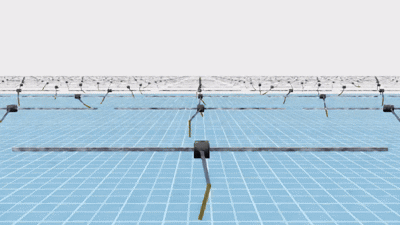

# About the Project

The goal of this project is to train an agent than can balance an inverted double pendulum by controlling the cart.


# Observation

The agent receives the observations consisting of:
1. the position and velocity of the cart
2. the degree and angular velocity of the joint connecting the cart and the pole
3. the degree and angular velocity of the joint connecting the two poles

Therefore, the shape of the observation is `(num_envs, 8)`.

# Action

The agent can only control the force applied on the cart. Therefore, the dimension of the action is `(num_envs, 1)`.

# Model

A simple neural network is selected to control the agent. It consists of four linear layers with `128` hidden neurons and activation functions `ELU`.

# Results



# How to Train?

Navigate to the `IsaacLab` folder and run the following command to train the model using the PPO algorithm from SKRL:

```
python scripts/reinforcement_learning/skrl/train.py \
  --task Cart_with_Double_Pendulum \
  --headless \
  --num_envs 4096 \
  --max_iterations 1000 \
  --video --video_length 300 --video_interval 2000
```