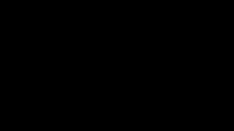
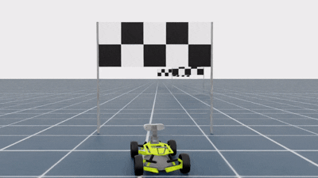

# About the Project

The goal of this project is to train an autonomous vehicle to navigate through a series of finish gates within a given time limit.


## Observation

The agent receives two types of observations:
1. The image captured by the car’s camera, with shape `(num_envs, H, W, 3)`.
2. The car’s state with shape `(num_envs, 8)`. It includes:
    * the car’s linear and angular velocities in the simulation world frame, and
    * the actions applied to the throttle and steering.

## Action

The agent needs to perform two types of actions:
1. Throttle joint velocity – controls the wheel velocity.
2. Steering angle – determines the direction of the car.

## Model

A custom model is used because SKRL’s model configuration offers limited flexibility.
The custom model consists of three components:
* `backbone`: A CNN module that extracts feature maps from the car camera images.
* `policy_layer`: A module with two linear layers. It takes as input both the feature map and the car’s state, then computes the policy for action selection. The output shape is `(num_envs, 2)`.
* `value_layer`: A module with two linear layers. It takes as input both the feature map and the car’s state, then predicts the value of the current state. The output shape is `(num_envs, 1)`.

## Curriculum

The curriculum technique is applied to accelerate training. The curriculum settings are shown in the table below:

| Curriculum Config | Show Way Points | Car to Gate Distance Tolerance | Gate Y Offset Scale |
|:----------------:| :-------------: | :----------------------------: | :-----------------: |
|1| ✅ | 0.25 | 1.0 |
|2| ❌ | 0.1 | 1.0 |
|3| ❌ | 0.1 | 2.0 |

* The waypoints are represented by green and red half-spheres positioned at the center of each gate. They serve as prominent visual cues, helping the car learn to pass through the middle of the gate rather than merely brushing past the two poles.
* As the car progresses through the curriculum, the gates exhibit greater variation in their positions along the y-axis, while the criteria for passing through a gate become stricter (achieved by reducing the distance tolerance).

<table class="field">
  <tr>
    <th><center>Initial Training</center></th>
    <th><center>Curriculum 1</center></th>
    <th><center>Curriculum 3</center></th>
  </tr>
  <tr>
    <td>
      
    </td>
    <td>
      
    </td>
    <td>
      
    </td>
  </tr>
</table>

## How to Train?

Navigate to the finish_gate_drive folder and run the following command to train the model using the PPO algorithm from SKRL:

```
python skrl_train.py \
    --task Finish-Gate-Drive-Direct \
    --num_envs 64 \
    --headless \
    --video --video_length 100 --video_interval 1000
```