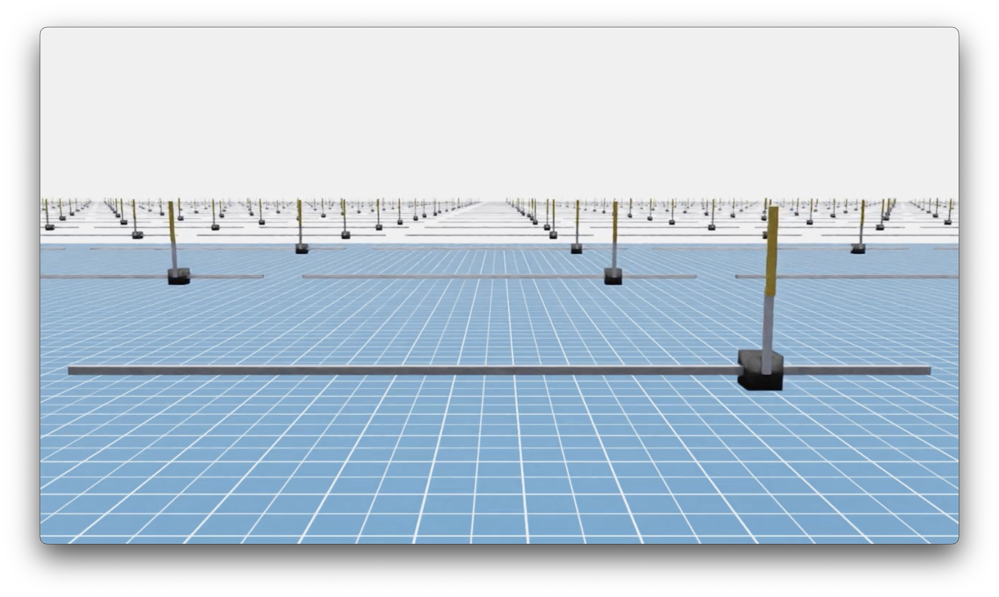
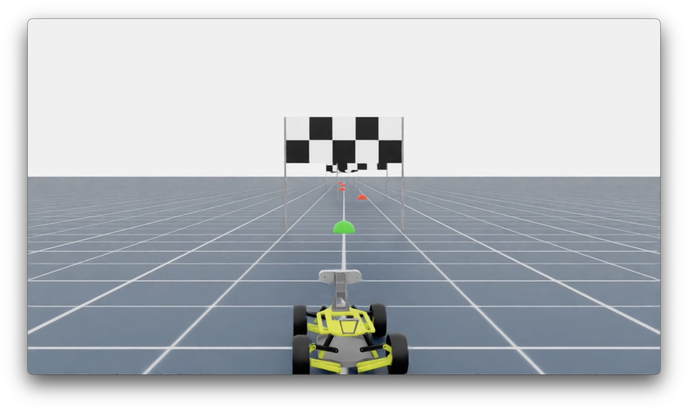

This repo demonstrates several simulation environments implemented with Isaac Sim and uses Isaac Lab to train agents through reinforcement learning.

# 1. Cart with Double Pendulum

This is an upgraded version of CartPole. The agent learns how to balance an inverted double pendulum by controlling the cart.

Unlike the [Cart Double Pendulum](https://github.com/isaac-sim/IsaacLab/tree/main/source/isaaclab_tasks/isaaclab_tasks/direct/cart_double_pendulum) demo in Isaac Lab, the agent in this version cannot control the joint between the two pendulums — it can only control the cart.

# 2. Finish Gate Drive

The goal of this project is to train an autonomous vehicle to navigate through a series of finish gates within a given time limit.

